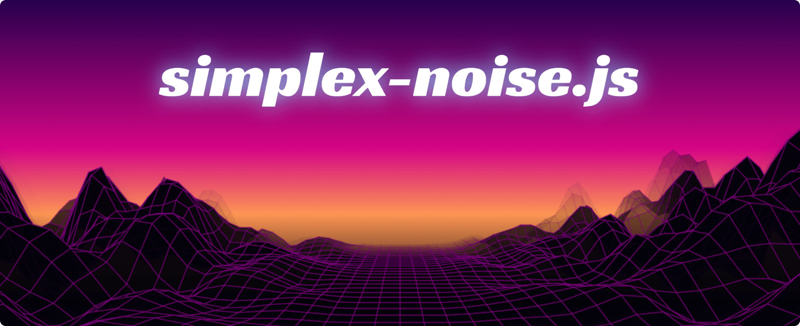

This is just a little canvas 2d demo for [simplex-noise.js](https://github.com/jwagner/simplex-noise.js). 

[View the demo](https://29a.ch/sandbox/2022/simplex-noise-synthwave/) or look at [main.ts](./main.ts) and [renderer.ts](./renderer.ts) to start digging through the code.

